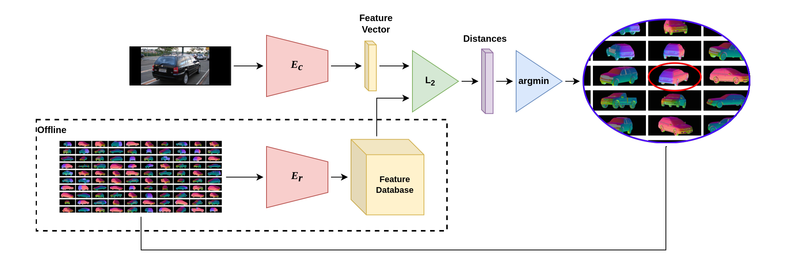

# contrastive-pose-retrieval



Code for paper "Category-Level Pose Retrieval with Contrastive Features Learnt with Occlusion Augmentation"

The table below presents the expected performance on PASCAL3D (L0) for 12 object categories:
|   | plane | bike  | boat  | bottle| bus   |   car | chair | table | mbike | sofa  | train | tv    | Mean  |
|---------------|------|-------|-------|-------|-------|-------|-------|-------|-------|-------|-------|-------|-------|
| Pi/6          | 84.8 | 88.1  |  82.5 |  91.7 |  98.7 |  99.2 |  95.9 |  88.8 |  85.6 |  97.0 |  98.0 |  90.0 |  92.3 |
| Pi/18         | 59.5 | 42.8  |  54.2 |  68.7 |  94.5 |  95.9 |  70.4 |  71.8 |  33.9 |  69.9 |  88.7 |  58.7 |  72.2 |
| MedErr        | 8.2  | 11.6  |   9.4 |   7.1 |   3.0 |   3.1 |   6.7 |   6.3 |  13.5 |  6.5  |  3.9  |   8.4 |  6.6  |

## Setup conda environment

- Install [Miniconda](https://docs.conda.io/projects/conda/en/latest/user-guide/install/linux.html)

- Create and activate a new conda environment:
```shell
conda create -n myenv
conda activate myenv
```

- Install pytorch related packages:
```shell
conda install pytorch torchvision torchaudio cudatoolkit=11.3 -c pytorch
conda install -c fvcore -c iopath -c conda-forge fvcore iopath
```

- Install dependencies:
```shell
pip3 install -r /path/to/requirements.txt
```

## Download and generate dataset(s)

(Needed for training and/or evaluation)

Follow the instructions in the repository of [NeMo](https://github.com/Angtian/NeMo/blob/main/README.md) to download and preprocess PASCAL3D

Follow the instructions in [OccludedPASCAL3D](https://github.com/Angtian/OccludedPASCAL3D) to generate an occluded version of PASCAL3D.

## Download PASCAL VOC 2012 for the synthetic-occlusion data augmentation
```shell
wget "http://host.robots.ox.ac.uk/pascal/VOC/voc2012/VOCtrainval_11-May-2012.tar"
tar -xf "VOCtrainval_11-May-2012.tar"
```

## Generate datasets of renderings
(Needed for training and/or evaluation)

Generate rendering counterparts for train and test splits of PASCAL3D+.
The script will generate rendering, silhouette, depth, and normal images for the
train and test splits, located on PASCAL_(train_)NeMo/renderings/. The script
takes a few hours at most to generate around 11k rendering per split.
```shell
python3 scripts/generate_pascal3d_renderings.py \
    --split="all" \
    --from_scratch="False" \
    --object_category="car" \
    --positive_type='all' \
    --root_dir="/path/to/datasets" \
    --downsample_rate="2" \
```
You can use the following command to inspect the images:
```shell
python3 scripts/visualize_pascal3d.py \
    --root_dir="/path/to/datasets"
    --symmetric \
    --split=train \
    --positive=normals
```

## Download trained models
You can download trained models for the all 12 PASCAL3D object categories from the following [https://drive.google.com/drive/folders/1BsYb6ttNwYRgT72z10ItZ-Vayj9jVios?usp=sharing](https://drive.google.com/drive/folders/1D5MmvqHOtYBv7YiQp8fiMcv53MMxVXb-?usp=sharing).

## Download encoded reference sets
You can download encoded reference sets for all 12 PASCAL3D object categories from the following [https://drive.google.com/drive/folders/1BsYb6ttNwYRgT72z10ItZ-Vayj9jVios?usp=sharing](https://drive.google.com/drive/folders/1BsYb6ttNwYRgT72z10ItZ-Vayj9jVios?usp=sharing).

## Training
In order to train on PASCAL3D you need to have followed all the aforementioned steps to download and preprocess PASCAL3D to generate the training and testing sets. Then simply execute the following script:
```bash
./scripts/train_pascal3d.sh
```
Make sure the provided paths in the script are correct!!!

## Evaluation
To evaluate a trained model simply execute the following script after adjusting the dataset and models paths and specifying the correct object category:
```bash
./scripts/evaluate_occluded_pascal3d.sh
```

## Inference on a single image
To get an idea how to use the pose estimator take a look at the predict_pose.py script or execute it giiven paths to the image, model weights, and reference embeddings.
```bash
python3 scripts/predict_pose.py
    --image_path=/path/to/query-image
    --weights_path=/path/to/trained_models/car
    --refset_path=/path/to/referense-embeddings
```


## Citation
---
Please cite the following paper if you find this the code useful for your research/projects.

```
@misc{kouros2022poseretrieval,
  doi = {10.48550/ARXIV.2208.06195},
  url = {https://arxiv.org/abs/2208.06195},
  author = {Kouros, Georgios and Shrivastava, Shubham and Picron, Cédric and Nagesh, Sushruth and Chakravarty, Punarjay and Tuytelaars, Tinne},
  title = {Category-Level Pose Retrieval with Contrastive Features Learnt with Occlusion Augmentation},
  publisher = {arXiv},
  year = {2022},
}
```
